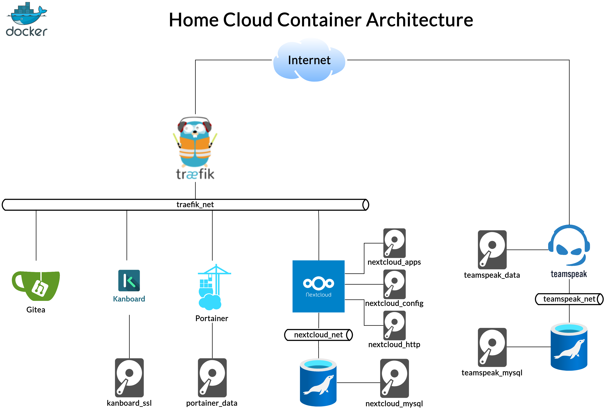

# Personal Home Cloud Container Setup # 

## Synopsis ##

This repository contains the docker-compose and configuration files for
my home cloud setup.

A description can be found on my blog: https://github.com/tbienias/blog/blob/master/posts/home-server.md

## HOWTO ##

### Traefik ###

1. In `.env` change `TRAEFIK_DOMAIN` to your domain (e.g. mydomain.com).
2. In `.env` change `TRAEFIK_ACME_EMAIL` to your Lets Encrypt E-Mail (e.g. myname@gmail.com).
3. In `.env` change `TRAEFIK_ACME_PROVIDER` to your DNS provider -
list of possible values [here](https://doc.traefik.io/traefik/https/acme/#providers).
4. In `traefik/traefik.env` setup environment vars according to chosen ACME provider.
For example when `TRAEFIK_ACME_PROVIDER=digitalocean` then `DO_AUTH_TOKEN=token_value`
has to be specified.
5. Make sure that `/opt/traefik/letsencrypt/acme.json` exists and access rights
are set to `600`.
6. `docker network create traefik_net`
7. `cd traefik && docker-compose up -d`

### Gitea ###

1. In `.env` change `GITEA_SSH_PORT` to the port on which you want git SSH be
available (e.g. 11122).
2. In `.env` change `GITEA_DATA_DIR` to a directory where Gitea stores files (e.g. `/mnt/data/gitea`).
3. In `gitea/app.ini` change `SSH_DOMAIN` to the domain you want to SSH clone from (e.g. gitea.mydomain.com).
4. In `gitea/app.ini` change `ROOT_URL` to the one you set in step 3, but prefix with https://
(e.g. https://gitea.mydomain.com).
5. In `gitea/app.ini` change `SSH_PORT` to the one you set in step 1 (e.g. 11122).
6. In `gitea/app.ini` change `DOMAIN` to the one you set in step 3 (e.g. gitea.mydomain.com).
7. In `gitea/app.ini` change `LFS_JWT_SECRET` to a large unique string.
8. In `gitea/app.ini` change `SECRET_KEY` to a large unique string.
9. In `gitea/app.ini` change `INTERNAL_TOKEN` to a large unique string.
10. In `gitea/app.ini` change `JWT_SECRET` to a large unique string.
11. Add user for running the Gitea container (e.g. gitea).
12. In `gitea/gitea.env` change `USER_UID` to the user id of user created in step 11.
13. In `gitea/gitea.env` change `USER_GID` to the group id of user created in step 11.
14. `cd gitea && docker-compose up -d`

### Kanboard ###

1. In `.env` change `KANBOARD_DATA_DIR` to a directory where Kanboard stores data (e.g. `/mnt/data/kanboard/data`).
2. In `.env` change `KANBOARD_PLUGINS_DIR` to a directory where Kanboard stores plugins (e.g. `/mnt/data/kanboard/plugins`).
3. `docker volume create kanboard_ssl`
4. `cd kanboard && docker-compose up -d`

### Portainer ###

1. `docker volume create portainer_data`
2. `cd portainer && docker-compose up -d`

### Nextcloud ###

1. In `.env` change `NC_DATA_DIR` to a directory where Nextcloud stores files (e.g. `/mnt/data/nextcloud/data`).
2. In `nextcloud/nextcloud.env` change MYSQL_PASSWORD to a large unique string.
3. In `nextcloud/nextcloud.env` change MYSQL_ROOT_PASSWORD to a large unique string.
4. `docker volume create nextcloud_apps`
5. `docker volume create nextcloud_config`
6. `docker volume create nextcloud_html`
7. `docker volume create nextcloud_mysql`
8. `docker network create nextcloud_net`
9. `cd nextcloud && docker-compose up -d`

Optional post-processing:

10. `docker exec --user www-data nextcloud php occ config:system:set trusted_domains 0 --value=nextcloud.mydomain.com`
11. `docker exec --user www-data nextcloud php occ config:system:set overwriteprotocol --value=https`

2FA disable (in case of emergency):

12. `docker exec --user www-data nextcloud php occ config:system:set twofactor_enforced --value=false`

### TeamSpeak ###

1. In `teamspeak/teamspeak_db.env` change `MYSQL_ROOT_PASSWORD` to a large unique string.
2. In `teamspeak/teamspeak.env` change `TS3SERVER_DB_PASSWORD` to the string you set in step 1.
3. `docker volume create teamspeak_data`
4. `docker volume create teamspeak_mysql`
5. `docker network create teamspeak_net`
6. `cd teamspeak && docker-compose up -d`

## License ##

MIT
